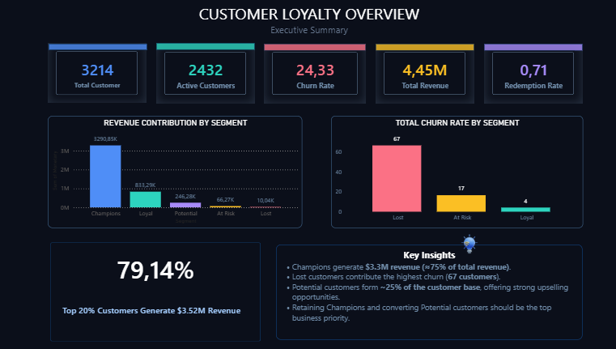
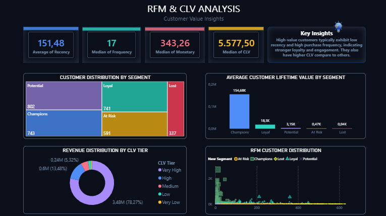
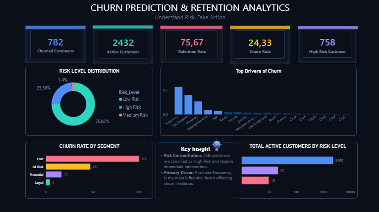

# Customer Loyalty & Churn Analytics Dashboard

## Project Overview

This project presents a customer loyalty and churn analytics dashboard built in Power BI. The dashboard analyzes customer behavior using RFM segmentation, customer lifetime value (CLV), churn risk, and revenue contribution analysis.

The goal is to identify high-value customers, understand churn patterns, and provide actionable insights for customer retention strategies.

## Dashboard Pages

### 1. Customer Loyalty Overview
This page provides an executive summary of customer performance, including total customers, active customers, churn rate, total revenue, redemption rate, and top 20% customer revenue contribution.

Key findings:
- Total customers: 3,214
- Active customers: 2,432
- Churn rate: 24.33%
- Total revenue: $4.45M
- Top 20% customers generate 79.14% of total revenue

### 2. RFM & CLV Analysis
This page analyzes customer value using Recency, Frequency, Monetary value, and CLV segmentation.

Key findings:
- Champions represent the highest-value customer group
- Very High CLV customers contribute the majority of total revenue
- Potential customers provide strong upselling opportunities

### 3. Churn Prediction & Retention Analytics
This page identifies churned customers, high-risk customers, and key churn drivers.

Key findings:
- 782 customers have churned
- 758 customers are classified as high risk
- Frequency and satisfaction are key churn drivers
- Lost customers account for the highest churn volume

## Tools Used

- Power BI
- DAX
- Customer Segmentation
- RFM Analysis
- CLV Analysis
- Churn Analytics
- Data Visualization

## Business Insights

- Champions contribute approximately 74% of total revenue.
- Top 20% of customers generate 79.14% of total revenue, showing strong revenue concentration.
- Lost customers have the highest churn volume and should be prioritized for reactivation campaigns.
- Potential customers should be targeted with upselling and loyalty engagement strategies.
- High-risk customers require immediate retention actions.

## Recommendations

1. Prioritize retention campaigns for high-risk and lost customers.
2. Reward Champions with exclusive loyalty benefits.
3. Convert Potential customers into Loyal or Champion segments.
4. Improve customer engagement frequency to reduce churn risk.
5. Monitor satisfaction and redemption behavior as early churn indicators.

## Author

Agnes Jeni Makay  
Master of Data Science and Decisions, UNSW  
GitHub: https://github.com/nesaugust
